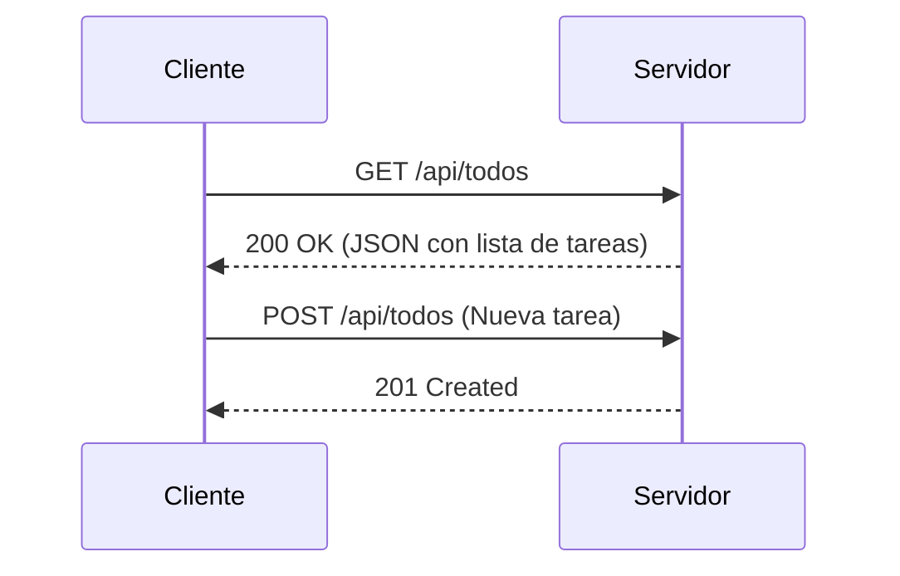
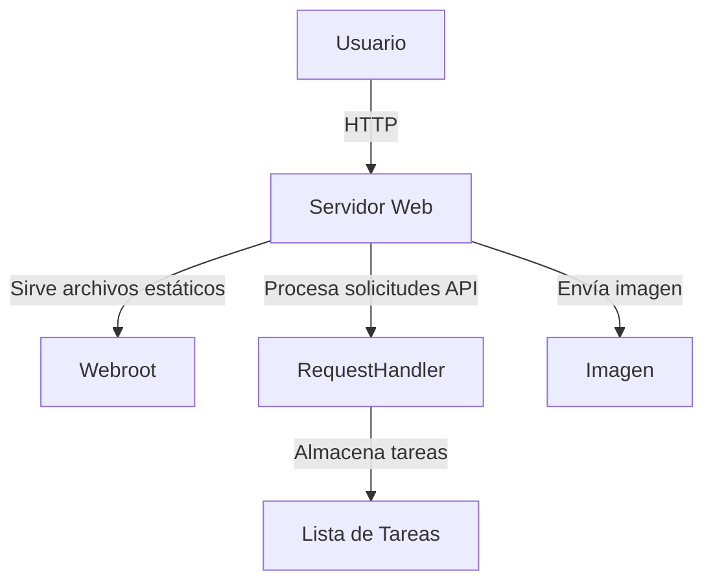
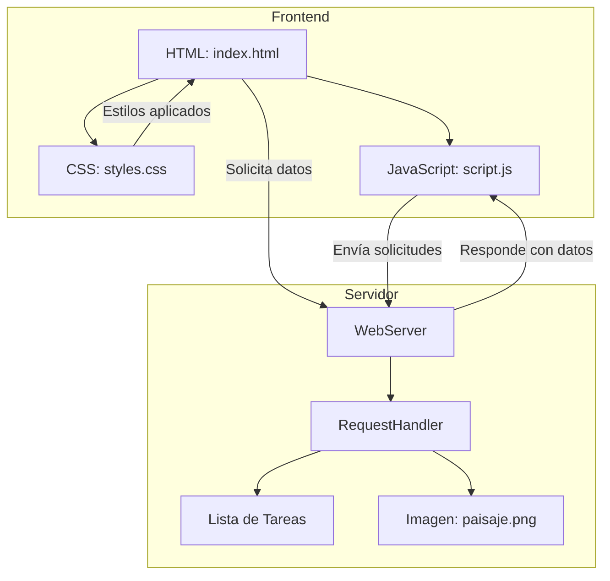

# WebServer Java Application

Este es un simple servidor web implementado en Java utilizando Maven. Maneja solicitudes HTTP para servir archivos estáticos y responder a solicitudes REST para gestionar una lista de tareas y mostrar una imagen.

## Requisitos

-   **Java Development Kit (JDK) 8 o superior**
-   **Maven 3.6.0 o superior**
-   **Un IDE como IntelliJ IDEA, Eclipse, o simplemente un editor de texto como Visual Studio Code**
-   **Un navegador web**

## Instalación

1.  **Clona el repositorio o descarga los archivos:**
     
    `git clone https://github.com/sebastian2929/AREP_LAB01.git` 
    
2.  **Compila el proyecto con Maven:** Asegúrate de tener Maven instalado y configurado en tu sistema. Luego, ejecuta:
 
    
    `mvn clean install` 
    
3.  **Estructura de archivos:** Asegúrate de tener la siguiente estructura de archivos en el directorio 
     `src/.../WebServer.java`
     `webroot/
       index.html
       styles.css
       script.js
       paisaje.png` 
    

## Ejecución

1.  **Inicia el servidor:** Ejecuta la siguiente clase de la aplicacion para iniciar la aplicación:
        
    `WebServer.java"` 
    
2.  **Accede al servidor:** Abre tu navegador web y visita `http://localhost:8080`. Aquí podrás:
    
    -   Ver la página principal (`index.html`).
    -   Agregar, ver y borrar tareas desde la interfaz.
    -   Mostrar una imagen almacenada en el servidor.

## Arquitectura

### Servidor Java

-   **Clase principal:** `WebServer`
    
    -   **Puerto:** 8080
    -   **Raíz web:** `webroot` (directorio desde donde se sirven los archivos estáticos).
-   **Manejo de solicitudes:**
    
    -   **GET**:
        -   `/api/todos`: Devuelve una lista de todas las tareas en formato JSON.
        -   `/api/paisaje`: Devuelve una imagen (`paisaje.png`) almacenada en el servidor.
        -   Otros archivos (como `index.html`, `styles.css`, `script.js`) se sirven desde el directorio `webroot`.
    -   **POST**:
        -   `/api/todos`: Agrega una tarea a la lista de tareas. El cuerpo de la solicitud debe contener un JSON con la tarea.
        -   `/api/todos/clear`: Borra todas las tareas.
-   **Clase interna:** `RequestHandler`
    
    -   Encargada de manejar cada conexión de cliente en un nuevo hilo. Procesa las solicitudes HTTP y envía las respuestas correspondientes.

### Frontend

-   **HTML:** `index.html` – Interfaz básica para interactuar con el servidor.
-   **CSS:** `styles.css` – Estilos aplicados para hacer que la interfaz se vea profesional y agradable.
-   **JavaScript:** `script.js` – Maneja la lógica del cliente, como enviar solicitudes al servidor y mostrar los resultados.

## Diagrama de Arquitectura
### Secuencia 

### Componentes

### Solicitudes

## Contacto

Autor: Sebastián David Blanco Rodríguez
